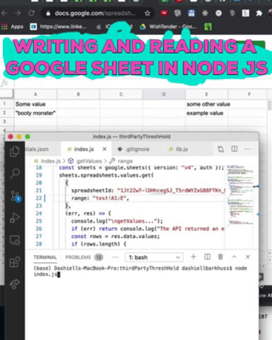

## Steps

1. Go to [Google Sheets API](https://developers.google.com/sheets/api/quickstart/nodejs) and click **Enable the Google Sheets API** to create a new Cloud Platform project. Follow the instructions:

- #### Notes:
  - For client OAuth pick "Desktop Application"
  - For a callback url I picked 'http://localhost:3000/callback' but it isn't used in this sample project.
  - Download the `credentials.json` file and put it in your working directory (ie: wherever you have index.js/app.js/server.js running).

The rest of the steps on that page are not necessary. Only **Enable the Google Sheets API**.

2. In `index.js`, replace the `spreadsheetId`. You can find your spreadsheet's id in the URL of your spreadsheet.

```javascript
    {
      spreadsheetId: "1BxiMVs0XRA5nFMdKvBdBZjgmUUqptlbs74OgvE2upms",
      range: "SheetName!A2:E",
    },
```

3. Replace the `range`. The sheet name of your sheet is located at the bottom of your google sheet. It isn't the name of the file.

4. Run `npm i`

5. Run `node index.js` in terminal and authorize following the instructions in the terminal.
